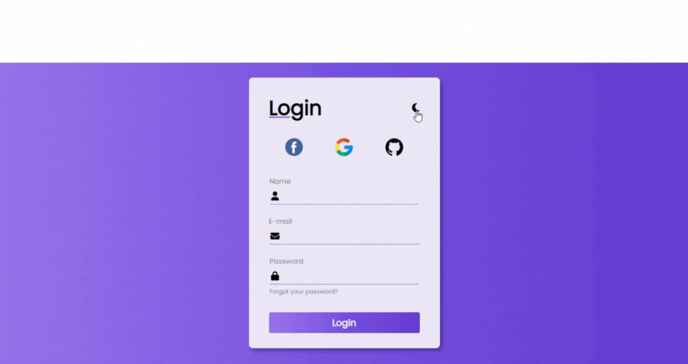

# 🌗 Dark Light Form

Projeto de um formulário de login com **tema claro e escuro**, usando HTML, CSS e JavaScript. 

## 🌐 Visualize o projeto:

**[Ver Projeto Online](https://carolinersant.github.io/dark-light-form/)**

## 📸 Demonstração
Veja abaixo uma demonstração do formulário em ação:

## 🚀 Funcionalidades

-  Troca entre tema claro e escuro
-  Formulário de login com campos para nome, e-mail e senha
-  Ícones para login rápido com Facebook, Google e GitHub
- Interface moderna e responsiva
- Animação suave no background e elementos

## 🛠️ Tecnologias Utilizadas

- HTML
- CSS
- JavaScript

## 🛠 Como usar

1. Clone este repositório:
git clone `https://github.com/carolinersant/dark-light-form.git`
2.  Abra o arquivo `index.html` no seu navegador.
